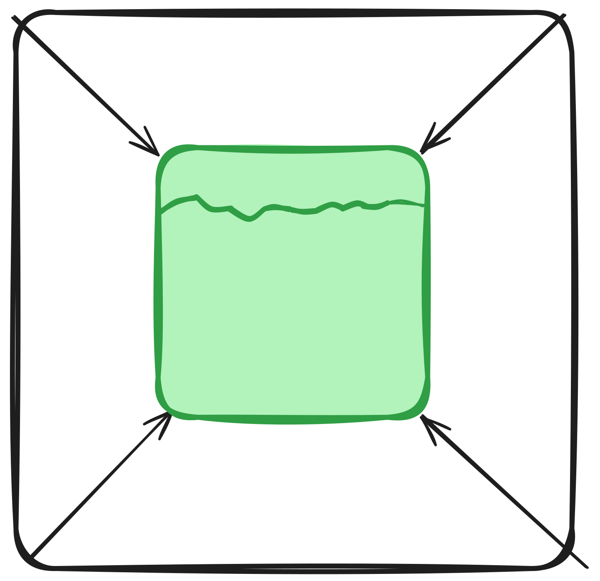

<h4>
This project is currently EXPERIMENTAL! <br />
Please check if your optimized pack works the same as your original pack does. <br />
Please <a href="https://github.com/TBroz15/TesserPack/issues">report any issues</a> you've encountered.
</h4>


<div align="center">
    
    <h6><code>logo made in excalidraw... pls dont judge me lol</code></h6>
    <h1>
        TesserPack
    </h1>
    <h5>
        Optimize Minecraft Resouce &amp; Behavior Packs at the speed of Ice Boats!<br>
        (get it? because its fast to travel)
    </h5>
</div>

**TesserPack** is a build tool for Minecraft that compiles and optimize any Minecraft pack to make it more easier for people to download. TesserPack can compress large packs such as [bedrock-samples](https://github.com/Mojang/bedrock-samples) by atleast twice smaller the size![^1]

## But why?

<p>There is a problem with big Minecraft packs. Where assets, scripts (in Bedrock Edition), and JSON files aren't well optimized in downloading for people who have internet issues. <b>TesserPack</b> fixes this by compressing packs as much as possible, reducing the bandwidth required to download and get micro-optimizations <i>vs. the unoptimized version of the packs.</i></p>

<details>
<summary><b>Motivation (with some ranting lol)</b></summary>
<p>
I have seen a lot of big servers (including Cubecraft and The Hive) having up to 50MB worth of Minecraft Packs, and yet the download speed is really awful. (AS IN 0.1MBPS. According to Ookla Speed Test, my download speed IS 300MBPS!)
</p>
<p>I also see the same problem not just from Minecraft, but in few websites, where they serve unoptimized assets. But there are web build tools to fix these such as Vite and ESBuild.</p>
<p>Then, I come up with an idea that is inspired by that said issue which is to optimize and compress pack assets, just to make it easier to download for users with bad internet (like me :P)</p>
<p>
And so, I made <a href="https://github.com/TBroz15/SuitcaseJS">SuitcaseJS</a>. Buuuuut, it was a real mess of a project to work in. Well, that's because it's built in Javascript. And you know that Javascript is y'know, being Javascript. I felt that I've picked the wrong programming language for that use case and I've abandoned ship the project.
</p>
<p>After writing this shakespeare of an essay, I am porting SuitcaseJS to Golang with a better name, <b>TesserPack.</b> (yeah its not going to be named SuitcaseGo because it felt broad)</p>
<i>btw i am currently learning golang, expect my code to suck but dont worry, it will improve in the long run. This project will be a fun challenge for me to expand my mind (aka. a place where my brain eating amoeba lived. poor fella died of hungry)</i>

</details>

<details>
<summary><b>Why the name "TesserPack?"</b></summary>
<p>I simply combined "tesseract" and "pack" together. I put "tesseract" because it is a cool shape. I put "pack" because the main function is to optimize Minecraft packs.</p>
</details>

## How to Use it?

### All you need is...

- Just a transistor! (the more transistor that a computer has, the better performance and less likely to crash)

### Installation?

As of now, TesserPack is available to download as an executable in the [Releases page](https://github.com/TBroz15/TesserPack/releases/latest) prebuilt. Just run the executable in the terminal if you are on the same directory or if you make it globally available to your terminal. The Go package will be available if TesserPack is near to complete as a project or there is nothing to add more features to TesserPack.

### Compile through CLI

This is an example on how to optimize your pack.

```bash
./tesserpack --in ./my-pack/ --out ./my-swag-dir/
```

The `--in` flag defines the directory path of the pack is supposed to be.

The `--out` flag is where the output of the compiled pack will appear.

<details>
    <summary><b>Really Cool Tips (click meeeee)</b></summary>
    <ul>
        <li>
            <p>You can put the relative path (<code>./</code>) or either the full path (<code>C:\Users\admin\Desktop\...</code> and so on) to define where the directory or file will be.</p>
        </li>
        <li>
            <p>You can set a custom filename for your output pack file.</p>
            <pre>./tesserpack --in ./my-pack/ --out ./epic-files/my-optimized-pack.mcpack</pre>
        </li>
        <li>
            <p>You can also compile it into a zip file.</p>
            <pre>./tesserpack --in ./my-pack/ --out ./epic-files/my-optimized-pack.zip</pre>
        </li>
        <li>
            <p>If you don't include the <code>--out</code> flag, well its fine! The optimized pack file will be in the same parent directory of the input pack.</p>
            <pre>./tesserpack --in ./epic-files/my-pack</pre>
            <i>The output pack will be in the <code>epic-files</code> directory.</i>
        </li>
        <li>
            <p>If you don't include the <code>--in</code> flag, well... it won't work of course!</p>
        </li>
        <li>
            <p>If you want to optimize an already compiled pack, fear no more! TesserPack can read zip/mcpack files, turn it into a directory and then compile it back.</p>
            <pre>./tesserpack --in ./my-pack.mcpack</pre>
            <i>The file name of the optimized pack will become <code>my-pack-optimized.mcpack</code> if <code>--out</code> flag wasn't included.</i>
        </li>
    </ul>
</details>

## TesserPack vs. SuitcaseJS

TesserPack is a rewritten Golang port and the successor of [SuitcaseJS](https://github.com/TBroz15/SuitcaseJS), with atleast the same features and purpose. But it is further improved from what SuitcaseJS was missing, such as:

- Better compilation performance[^2] [^3]
- Less memory usage (up to 10x)[^2] [^4]
- Small fixes & features:
    - Copy the original image if the "optimized" version has larger size
    - Can run multiple instances [^5]
    - Recompile already compiled packs (zip/mcpack)
    - [^2]
- JSON5 support
- User-friendly GUI (coming soon)
- JS & TS minification (also coming soon)

[^1]: Comparison of the uncompiled & unzipped pack to an optimized & zipped pack.
[^2]: That's because it isn't written in Javascript. 
[^3]: TesserPack was designed to handle large Minecraft packs like [bedrock-samples](https://github.com/Mojang/bedrock-samples) without some overhead. It had easier and proper multithreading than in SuitcaseJS, all thanks to Golang's Goroutines.
[^4]: I've found that SuitcaseJS is using ~1.2GB vs. TesserPack with ~100MB in their peak RAM usage when compiling [bedrock-samples](https://github.com/Mojang/bedrock-samples). dat so insane vro ☠️☠️☠️ -TuxeBro
[^5]: Running multiple instances of SuitcaseJS will break since it works in a hard coded directory (*homedir*/.suitcase/temp) at the same time. TesserPack can have multiple instances but it will warn you since it can be resource intensive.